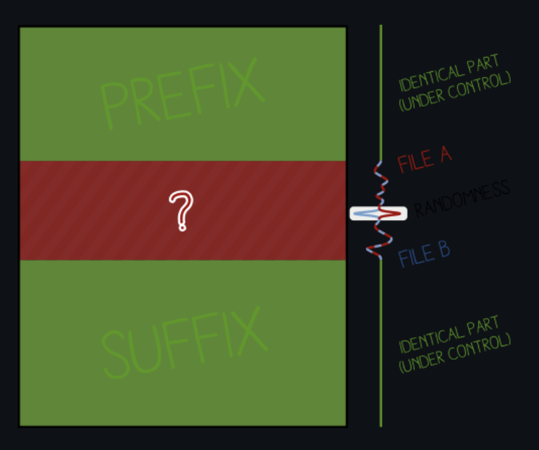

# STMCTF'22 Final

## Soru İsmi:
`oldschool 2/3`

## Kategori:
- `Misc`

## Soru:
```
TR:
Not: WEB/PWN sorusu değildir, sayfanın upload özelliğine bir saldırı yapmayın.

İki adet dosya oluşturun. Boyutları aynı olsun.
Dosyaların MD5 HASH değerleri aynı, SHA256 HASH değerleri farklı olsun.
Her iki dosyanın da ilk 8 byte'ında "STMCTF22", son 5 byte'ında "FLAG?" yazsın.
Bu iki dosyayı md5school.stmctf.com'a aynı anda yüklediğinizde FLAG sizde.


Sizin için STMCTF21 olacak sekilde örnek iki adet dosya hazırladık.
Siz STMCTF22'li olanı yeniden hazırlayın.

MD5 (ornek_sample1) = 89df49022847ff1888a418bcd9142cb9
MD5 (ornek_sample2) = 89df49022847ff1888a418bcd9142cb9

SHA256 (ornek_sample1) = 396aefa151425e87c78019c52d4fe25c3ad69beec67b5851268dbf84c8bcca2d
SHA256 (ornek_sample2) = 380beb28bff1a0443426d5aa31a6f16d6ee2dbb3e21799dc5764be0a06084b75

head -c 8 ornek_sample1
STMCTF21

head -c 8 ornek_sample2
STMCTF21

tail -c 5 ornek_sample1
FLAG?

tail -c 5 ornek_sample2
FLAG?


EN:
Note: It is not a WEB/PWN question, do not attack the upload feature of the page.

Create two files. Let them be the same size.
Let the files have the same MD5 HASH values and different SHA256 HASH values.
"STMCTF22" in the first 8 bytes of both files, and "FLAG?" in the last 5 bytes. write it.
When you upload these two files to md5school.stmctf.com at the same time, you have the FLAG.

We have prepared two sample files for you as STMCTF21.
You create the new one with STMCTF22.
MD5 (ornek_sample1) = 89df49022847ff1888a418bcd9142cb9
MD5 (ornek_sample2) = 89df49022847ff1888a418bcd9142cb9

SHA256 (ornek_sample1) = 396aefa151425e87c78019c52d4fe25c3ad69beec67b5851268dbf84c8bcca2d
SHA256 (ornek_sample2) = 380beb28bff1a0443426d5aa31a6f16d6ee2dbb3e21799dc5764be0a06084b75

head -c 8 ornek_sample1
STMCTF21

head -c 8 ornek_sample2
STMCTF21

tail -c 5 ornek_sample1
FLAG?

tail -c 5 ornek_sample2
FLAG?
```

---

## Çözüm:

Bizden istenen MD5 Hash Collision örneğidir. Oluşturulacak olan dosyaların ilk 8 byte'ında "STMCTF22", son 5 byte'ında "FLAG?" yazması istenmektedir. Bu nedenle internette bulacağınız hazır bir Collision dosya çifti işimize yaramayacaktır.

MD5 collision ile ilgili https://github.com/corkami/collisions sayfası detaylı bilgi vermektedir. Benzer içerikli başka kaynaklarda da mevcuttur.

Dosyanın başında STMCTF22 yazması (prefix) ve dosyanın sonunda yazması beklenen FLAG? (suffix) için FastColl veya UniColl da denenebilir. Biz çözümüzde HashClash sayfasında bulunan (https://github.com/cr-marcstevens/hashclash) identical-prefix collision yöntemini kullandık. HashClash ile  2 CPU'lu bir sanal bilgisayarda yaptığımız denemelerde 15-20 dk içerisinde istediğimiz dosya çiftini oluşturabildik.  

HashClash git sayfasındaki README.md adımlarına göre kurulum yapılır.

Aşağıdaki komutlar ile prefix'i STMCTF22 olan, MD5 değerleri aynı, SHA256 değerleri farklı iki adet dosya oluşturulabilir.

```bash
echo -n "STMCTF22" > file
	./hashclash/scripts/poc_no.sh file
```

poc_no.sh scripti söz konusu dosyaları 2 CPU'lu bir sanal makinada 15-20 içinde oluşturmaktadır. Bazen durdurup tekrar çalıştırmak süreyi kısaltabiliyor.



collision1.bin ve collision2.bin dosyaları oluştuktan sonra kontrol altında bulunan suffix kısmına ekleyeceğimiz aynı veri her iki dosyanın MD5 değerlerini aynı olacak şekilde değiştirecek fakat SHA256 değerleri yine farklı olacaktır.

```bash
echo -n "FLAG?" >> collision1.bin
echo -n "FLAG?" >> collision2.bin
```

collision1.bin ve collision2.bin dosyaları flag için aradığımız dosyalardır. 
