# STMCTF'22 Ön Eleme

## Soru İsmi:
`meow`


## Kategori:
- `Malware`


## Soru:

```
TR:

EN:

```

---

## Çözüm:

Paket sayısının çok olduğu bir pcap dosyası bulunmaktadır. İncelenmeye TCP protokolündeki verilerin ne olduğu kontrol edilerek başlanmaktadır. Data olarak filtrelendiği zaman, 4444 ve 8888 gibi shell bağlantısında sıklıkla kullanılan portların kullanıldığını görülmektedir.

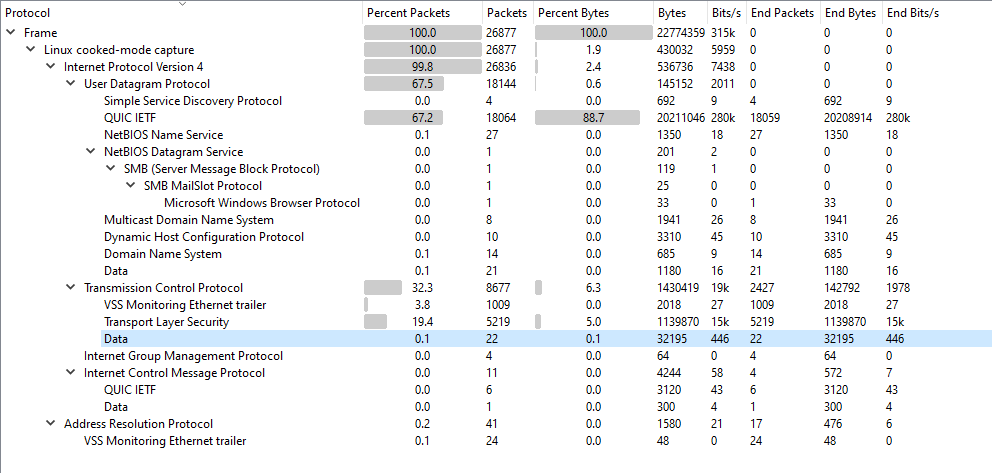

4444 portunun TCP akışı filtrelendiği zaman, pcap içerisinde ssl key log dosyasının bulunmasını isteyen bir diyaloğun olduğu görülmektedir.


8888 portunun TCP akışı filtrelendiği zaman ssl key log dosyası elde edilmektedir.

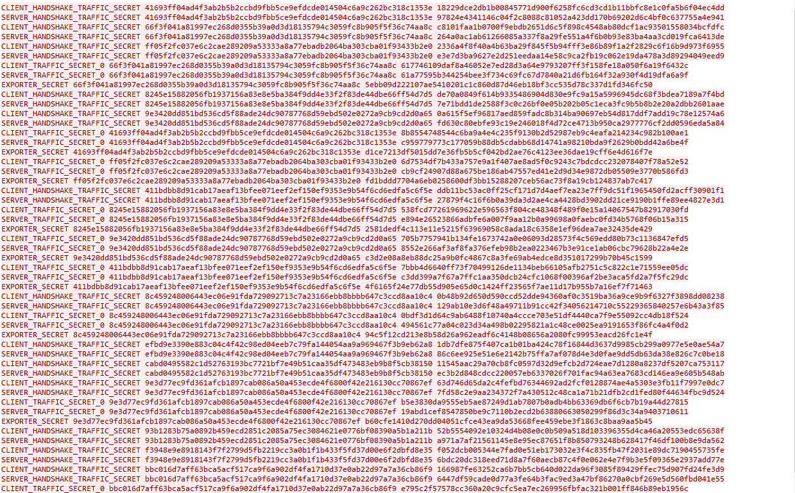

Şifrelenmiş trafik açıldığı zaman yapılan işlem trafiğin içerisinde herhangi bir dosyanın varlığının kontrol edilmesidir.Bununla beraber **hayatbeninedenyoruyorsunmademcokgunahoyunusenbozuyorsun.exe** çalıştırılabilir dosyasını tespit edilmektedir.


Dosyanın indirilme işlemine ait HTTP akış görüntüsü aşağıdaki gibidir.

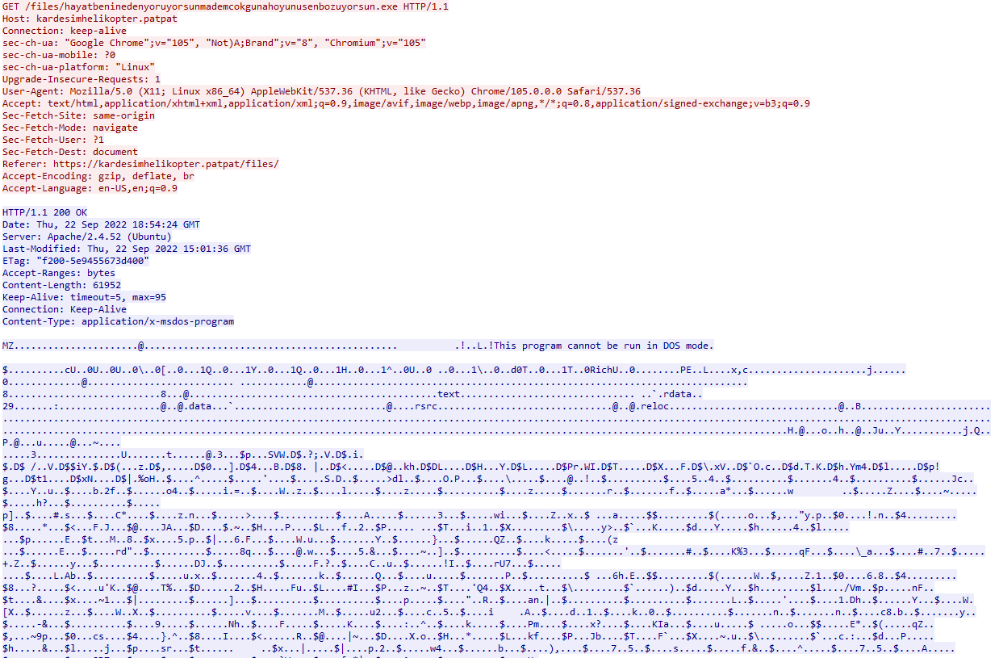

Dosya incelenmeye başlandığında, bir çok anti debug, anti vm ve anti analiz tekniklerinin kullanıldığı görülmektedir.

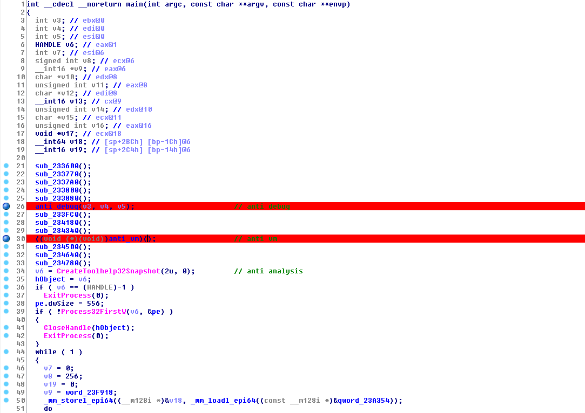


Anti tekniklerden biri olan **IsDebuggerPresent()** fonksiyonunun, PEB yapısındaki BeingDebugged ait flag değerinin patchlenmesi ile ilgili kontrol atlatılmaktadır. 


Diğer anti tekniklerde aynı şekilde patchlendikten sonra, stringslerde kullanıldığı fark edilen **advobfuscator** obfuscation aracının kullanıldığı görülmektedir. Bu araca ait, deobfuscation işleminden sonra **explorer.exe** stringi elde edilmektedir.

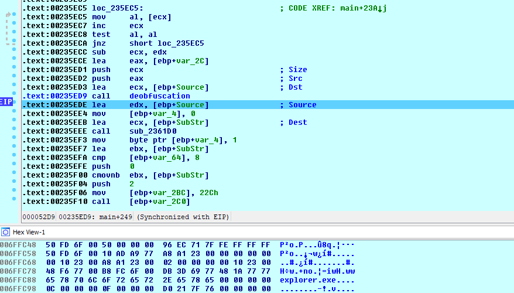

Ardından explorer.exe'nin Process ID değeri tespit edilmeye çalışılmaktadır.

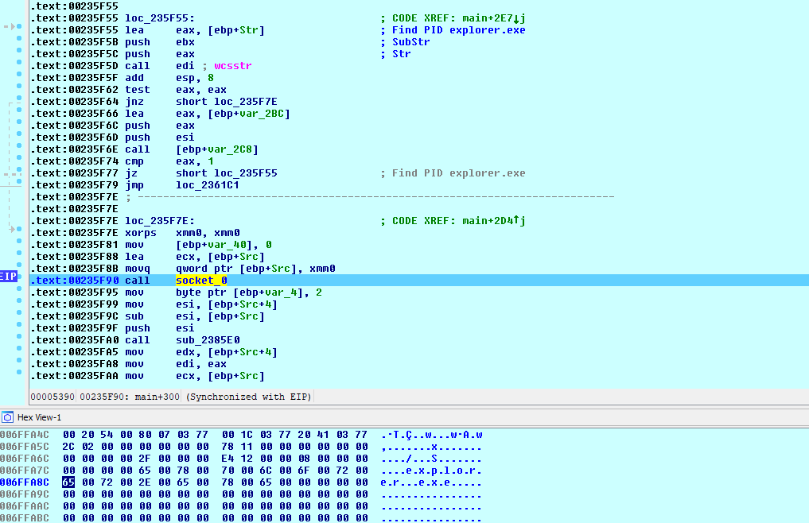

Process ID değeri bulunduktan sonra, **iblis.keser** domaininin **30303** portundan bağlantı açıldığı ve **GET** komutunun gönderilmesi ile sunucudan veri alındığı görülmektedir. Alınan verinin şifreli bir shellcode olduğu görülmektedir.


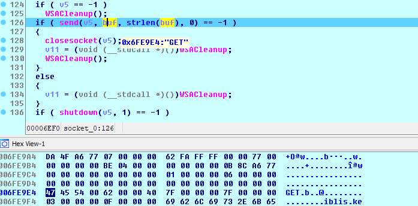

İncelenmeye devam edildiğinde bir diğer deobfuscation işleminin yapıldığı görülmektedir. Bu işlemden sonra **ZenitsuAgatsuma** stringi elde edilmektedir.

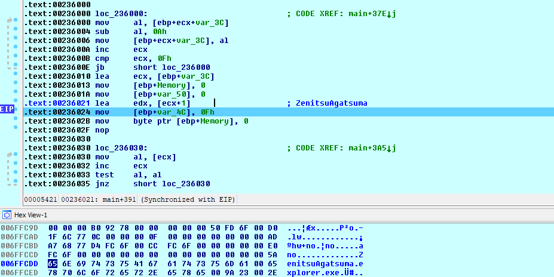

**ZenitsuAgatsuma**'nın ilk harfi ile şifreli shellcode çözülmeye çalışılmaktadır.


Şifreli shellcode çözüldükten sonraki hali aşağıdaki gibidir.

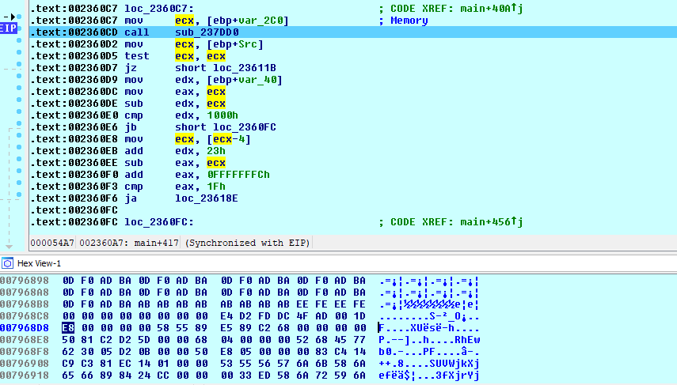

Analiz edilmeye devam edildiğinde, tekrar bir deobfuscation işleminin yapıldığı sonrasında **init** stringinin elde edildiği ve GetProcAddress() fonksiyonu ile aynı işlemi yapan fonksiyon ile init fonksiyonuna ait adresin bulunduğu görülmektedir. Buradan şifresi çözülen shellcode'un dll olduğu ve export fonksiyonu olan **init** fonksiyonunun çağrıldığı görülmektedir.

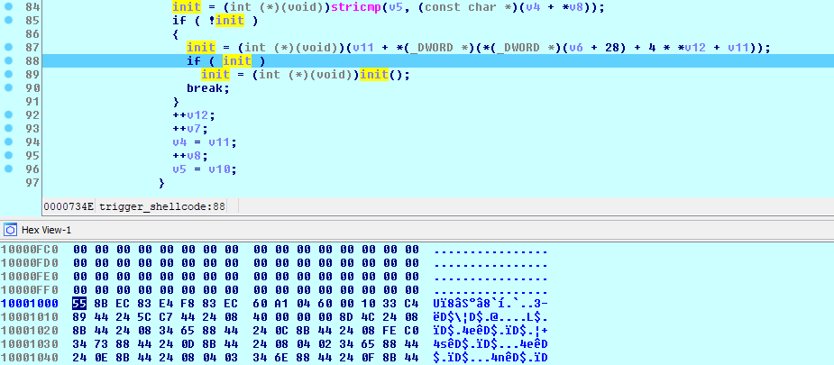

Dll içerisinde de deobfuscation işleminin yapıldığı görülmektedir. Deobfuscation işleminden sonra **esenyurttrap2.merso** ve **meow.php** stringleri elde edilmektedir.

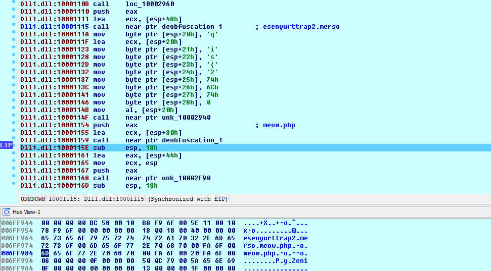

**8080** portu üzerinden **esenyurttrap2.merso**'nun **meow.php** dizinine internet bağlantısı yapılmaya çalışıldığı görülmektedir.

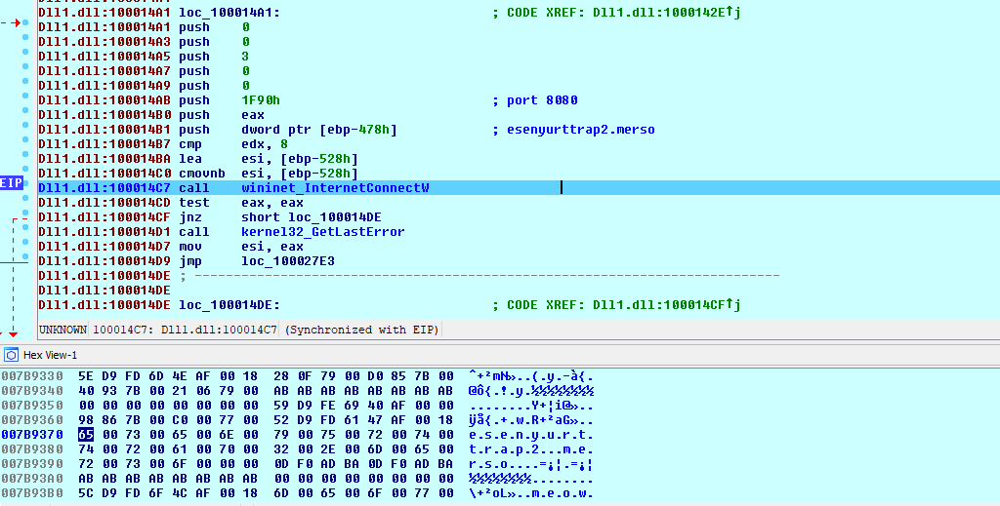

**meow.php** dosyasına yapılan **POST** isteği aşağıdaki gibidir..


**pass=**, **s3nm4k1n4s1n** ve **&watching=%3E%3E** stringlerinin de aynı şekilde deobfuscate edildiği görülmektedir.


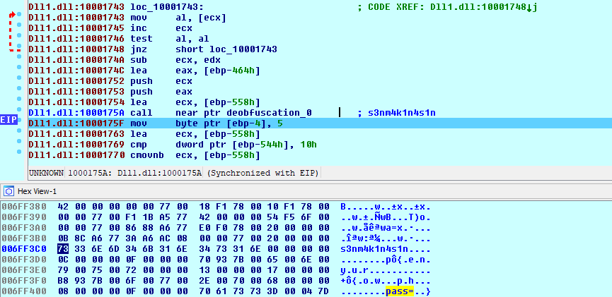
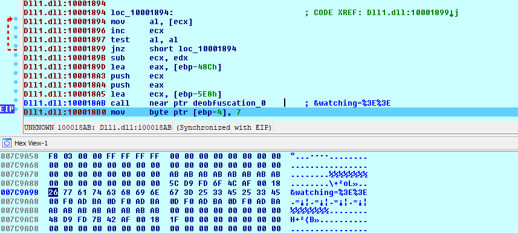

**OfflineisComing!** stringinin rc4() şifreleme algoritmasında,**s3nm4k1n4s1n** stringini şifrelemek için anahtar olarak kullanıldığı görülmektedir.

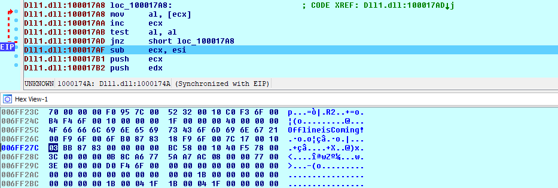

rc4() algoritması ile şifrelenmiş **s3nm4k1n4s1n** stringinin karşılığı olarak **e¦K³å~.ÂI.úr** stringi gözükmektedir.


**Content-Type: application/x-www-form-urlencoded**, **https://esenyurttrap2.merso:8080** ve **ceb37a03b805deac04c8205693b51d36key=b20f96e5878b0a47ff8626c8f757e35b** stringler aynı şekilde deobfuscate edilmiştir.

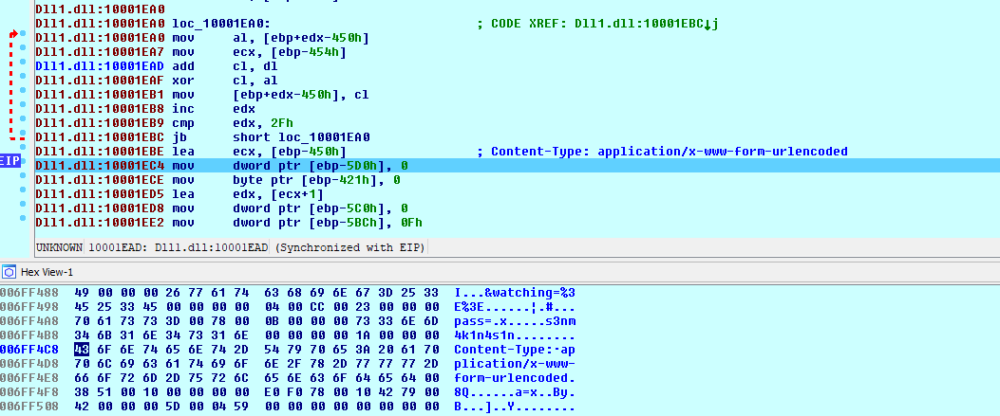

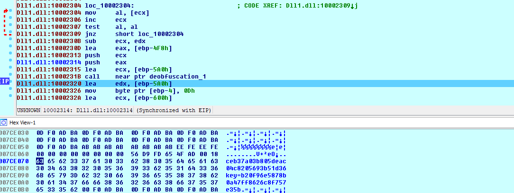

Bu işlemlerden sonra **ceb37a03b805deac04c8205693b51d36key=b20f96e5878b0a47ff8626c8f757e35b** cookie değeri HTTP isteğine eklenmektedir.


HTTP isteği gönderildikten sonra dönen cevabın başarılı bir şekilde okunduğu görülmektedir.


Giden isteğin HTTP akışı aşağıdaki gibidir.

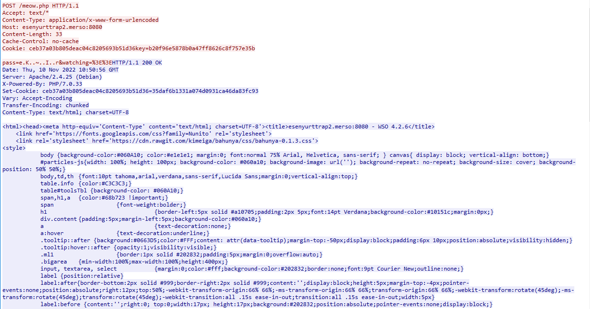

**pass=** değişkeninin rc4() şifreleme algoritmasından dönen değerinin **e¦K³å~.ÂI.úr** olduğu görülmektedir. Trafik şifreli bir şekilde iletişim kurmadığı için, **s3nm4k1n4s1n** stringi rc4() algoritmasından dönen şifreli değeriyle gönderilmektedir. İstek atılan url kontrol edildiğinde bir giriş sayfasının olduğu gözükmektedir.  


Bu giriş sayfasına **s3nm4k1n4s1n** ile girildiğinde WSO Web Shell karşımıza çıkmaktadır. Web Shellin sadece dizin listeleme özelliğinin açık olduğu görülmektedir. 


**/home/meow** dizinine gidildiğinde **flag.txt** dosyasının içeriği okunduğunda flag elde edilmektedir.

